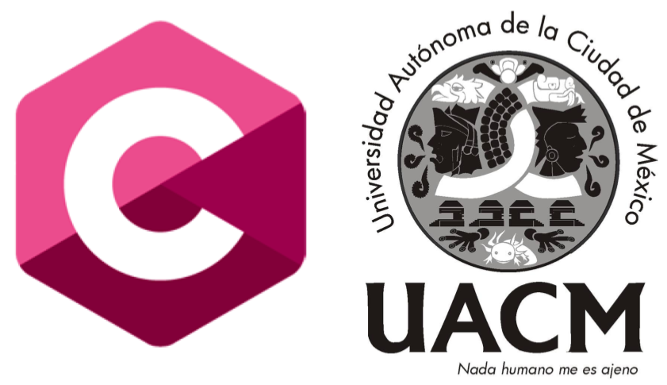

## Introducción a la programación, 2020-1

### Información general

**Grupo 321**

**Profesor:** L. en C.C. Manuel Soto Romero  
Lunes a Jueves 14:30 a 16 hrs. Aula A-007

### Descripción

Introducción a la Programación es una materia obligatoria del primer semestre del Colegio de Ciencia y Tecnología en la Universidad Autónoma de la Ciudad de México. Tiene como principal objetivo aprender los conceptos básicos de la programación estructurada mediante el desarrollo de distintos algoritmos y su implementación en el lenguaje de programación C.

### Contenido

#### Unidad 1: Conceptos generales

- [Sesión 1: Procesamiento de Instrucciones I](sesion01/README.md)
- [Sesión 2: Procesamiento de Instrucciones II](sesion02/README.md)
- [Sesión 3: Diseño de algoritmos con __Karel__](sesion03/README.md)

#### Unidad 2: Introducción al Lenguaje de Programación __C__

- [Sesión 4: Operaciones de salida en __C__](sesion04/README.md)
- [Sesión 5: Aritmética en __C__](sesion05/README.md)
- [Sesión 6: Estructuras de Decisión](sesion06/README.md)
- [Sesión 7: Estructuras de Decisión Múltiple](sesion07/README.md)

[`Siguiente`](sesion01/README.md)
