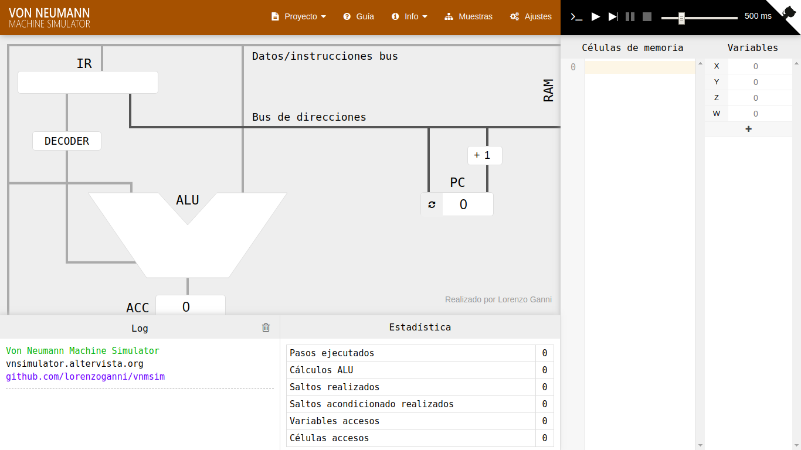

[`Introducción a la Programación`](../README.md) > `Sesión 1`

## Sesión 1: *Von Neumann Simulator*


El modelo de von Neumann es, como su nombre lo indica, una arquitectura de computadora, es decir, un modelo que muestra 
cómo funciona una computadora y la forma en que interactúan los componentes de hardware.

Está formado por una Unidad Central de Proceso que a su vez contiene una Unidad Aritmética Lógica y los registros del procesador, una unidad de control y un contador de programa. También posee una memoria principal y un mecanismo de 
entrada y salida.


### :dart: <ins>Procesamiento de instrucciones</ins>

La Unidad Central de Proceso es la encargada de interpretar y procesar las instrucciones dadas por un programa a través
de las operaciones básicas aritméticas y lógicas realizadas por la Unidad Aritmético Lógica. Para esto, utiliza los
registros del procesador que son una pequeña memoria que almacena datos binarios y tiene un tiempo de acceso cinco a 
diez veces menor que la memoria principal, uno de los registros es denominado Contador de Programa y es quien calcula
automáticamente la cantidad de ciclos de ejecución y apunta a la siguiente instrucción en ser ejecutada. Y por último
se encuentra la Unidad de Control que es aquella que tiene como objetivo buscar instrucciones en la memoria principal y
ejecutarlas luego de decodificarlas.

La Unidad Central de proceso únicamente entiende *código máquina*, es decir, instrucciones expresadas en binario. Estas
instrucciones son obtenidas a partir de un programa escrito en un *lenguaje de programación de alto nivel* que se
traduce a un *lenguaje ensamblador* también llamados de *bajo nivel* y finalmente se transforma a código máquina. El 
proceso completo se lista a continuación:

1. Definición de un programa en un lenguaje de alto nivel
2. Traducción del programa a código ensamblador
3. Traducción del programa a código máquina
4. Ejecución del programa por el procesador

Cada procesador, se construye con su propio lenguaje ensamblado con una sintaxis y comportamiento bien definido.

Con el fin de ilustrar el procesamiento de instrucciones, haremos uso de la plataforma *Von Neummann Simulator* que 
muestra la ejecución de instrucciones a través de los distintos componentes de un procesador ficticio. La forma de
ejecutar el simulador es mediante la inserción de un programa escrito en su propio lenguaje ensamblador.



---

> :rocket: **Actividad**   
Ingresa a la página del simulador http://vnsimulator.altervista.org/ e identifica cada uno de los componentes del
procesador.

---

### :dart: <ins>Operaciones</ins>

Como mencionamos anteriormente, el simulador cuenta con su propio lenguaje ensamblador que consiste de una serie de
operaciones que pueden hacerse dentro de los registros o ejecutarse directamente en la Unidad Aritmético-Lógica. Algunas
de estas operaciones son:

| Operacion   | Descripción |
|-------------|-------------|
| `LOD <Dir>` | Transfiere el dato almacenado en la posición de memoria `<DIR>` al acumulador de la ALU. |
| `STO <Dir>` | Guarda el contenido del acumulador en la posición de memoria `<DIR>`. |
| `DIV <Dir>` | Divide el contenido del acumulador entre el dato almacenado en la posición de memoria `<DIR>`. El resultado queda almacenado en el acumulador. |
| `DIV <Num>` | Divide el contenido del acumulador entre el número especificado. El resultado queda almacenado en el acumulador. |
| `MUL <Dir>` | Multiplica el contenido del acumulador entre el dato almacenado en la posición de memoria `<DIR>`. El resultado queda almacenado en el acumulador. |
| `MUL <Num>` | Multiplica el contenido del acumulador entre el número especificado. El resultado queda almacenado en el acumulador. |
| `ADD <Dir>` | Suma el contenido del acumulador entre el dato almacenado en la posición de memoria `<DIR>`. El resultado queda almacenado en el acumulador. |
| `ADD <Num>` | Suma el contenido del acumulador entre el número especificado. El resultado queda almacenado en el acumulador. |
| `SUB <Dir>` | Resta el contenido del acumulador entre el dato almacenado en la posición de memoria `<DIR>`. El resultado queda almacenado en el acumulador. |
| `SUB <Num>` | Resta el contenido del acumulador entre el número especificado. El resultado queda almacenado en el acumulador. |
| `HLT`       | Indica el fin del programa |

Puedes revisar el resto de las operaciones en la `Guía`.

---

:blue_book: **Ejemplo.** Escribiremos un programa que sume tres números. Estos números se encuentran almacenados en la 
memoria. Dentro del simulador podemos colocarlos en la sección llamada `Variables`. Por ejemplo, podemos colocar los 
números `X=10`, `Y=10` y `Z=7`.

Para escribir el programa, debemos recordar cómo calcular promedios. En este caso, debemos sumar los tres números y 
dividr el resultado entre tres. Para sumar los números debemos cargarlos en la Unidad Aritmético-Lógica primero.

A continuación se muestra el programa:

```assembly
LOD  X
ADD Y
ADD Z
DIV #3
STO W
HLT
```

- La primera instrucción `LOD X` carga el registro de memoria `X=10` en el acumulador de la ALU `ACC=10`.
- La segunda instrucción `ADD Y` suma el valor del acumulador `ACC=10` con el registro de memoria `Y=10`, quedando 
`ACC=20`.
- La tercera instrucción `ADD Z` suma el valor del acumulador `ACC=20` con el registro de memoria `Z=7`, quedando
`ACC=27`.
- La cuarta instrucción `DIV #3` divide el valor del acumulador `ACC=27` por el número `#3`, quedando `ACC=9`.
- La quinta instrucción `STO W` toma el valor del acumulador `ACC=27` y lo guarda en el registro de memoria `W`.
- Finalmente la instrucción `HLT` finaliza el programa.

---

> :rocket: **Actividad**   
Ingresa el programa anterior y ejecutalo. Cambia el valor de las variables dentro de los registros de memoria y observa
los resultados.

---

[`Anterior`](../README.md) | `Siguiente`

</div>
