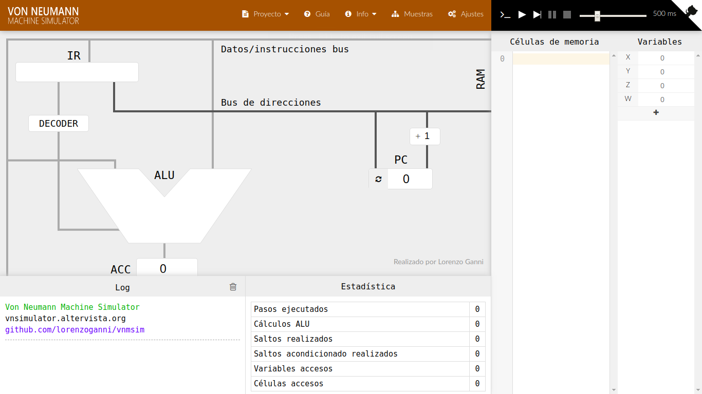
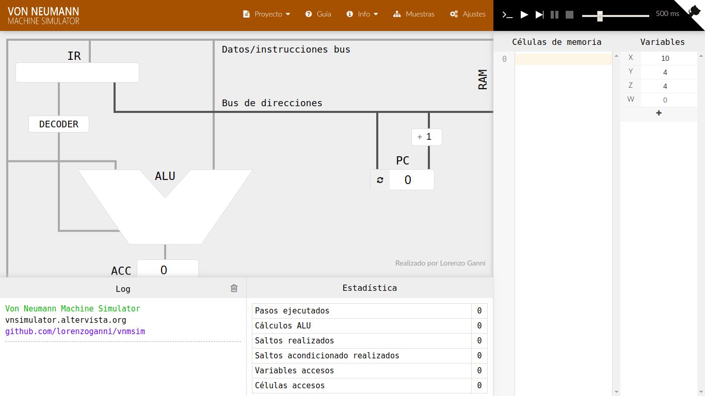
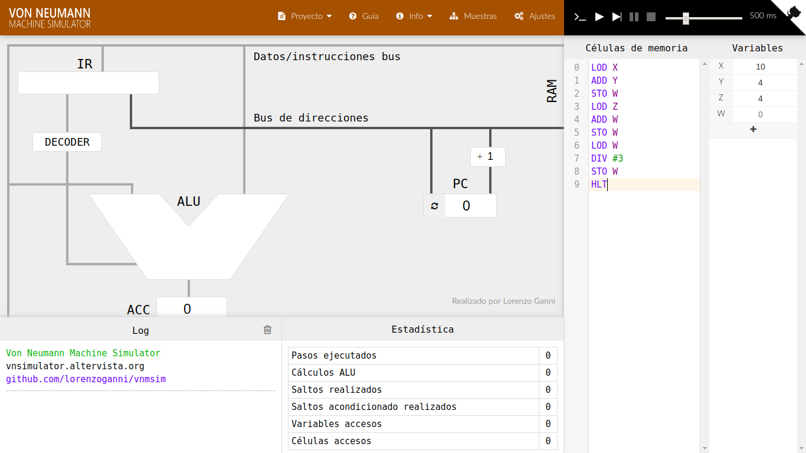
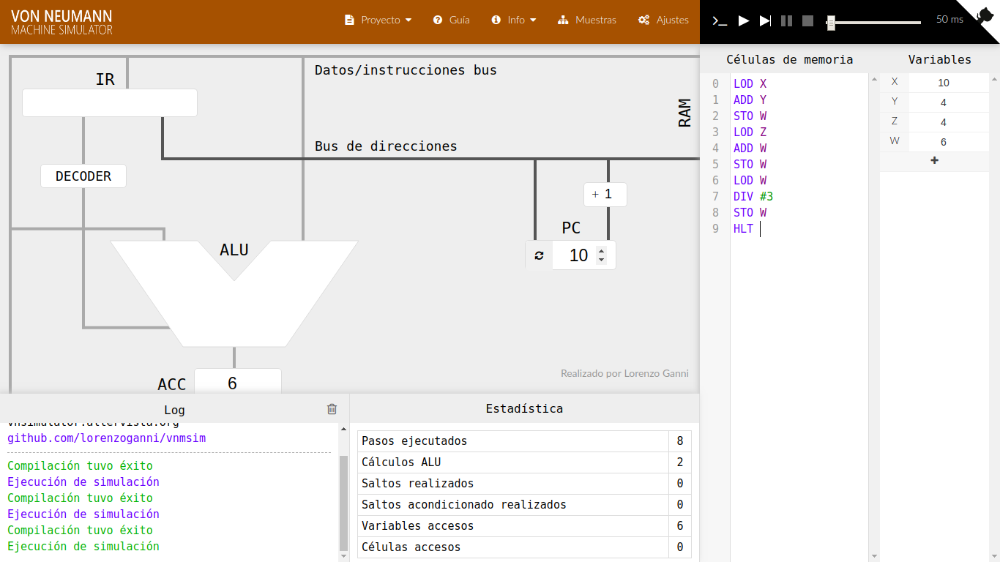

[`Introducción a la Programación`](../../Readme.md) > [`Sesión 01`](../Readme.md) > `Ejemplo 01`

## Ejemplo 1: Procesamiento de instrucciones

### OBJETIVO

- Repasar el concepto de procesamiento de instrucciones de manera gráfica.

#### REQUISITOS

1. Página del simulador: [Von Neumann Simulator](http://vnsimulator.altervista.org/)

#### DESARROLLO

1. Ingresa a la página del simulador.

   

   En esta página puedes apreciar dos de los componentes de la *Arquitectura de von Neumann*: (1) La memoria RAM del lado derecho y (2) la Unidad Central de Proceso del lado izquiero.

   Dentro de la memoria RAM, tenemos:

   - Las células de memoria o instrucciones.
   - Los registros de almacenamiento.

      *Recuerda que este almacenamiento es temporal*

   Dentro de la Unidad Central de Proceso, tenemos:

   - La Unidad de Control, formada por la ALU, el decodificador de instrucciones, el registro de instrucción (IR) y el contrador de programa (PC).

   Todos estos componentes se encuentran unidos mediante el *bus* de instrucciones y el *bus* de direcciones.

2. En la [Nota de Clase 1](https://drive.google.com/open?id=1dgocc-fIEG-PvHYwdnayRqnvPddF2HAo) vimos un pequeño programa que calculaba el promedio de tres números. Cuyo código en ensamblador es el siguiente:
   
   ```
   Carga  00
   Suma   01
   Guarda 04
   Carga  02
   Suma   04
   Guarda 04
   Carga  04
   Divide 03
   Guarda 04
   Alto
   ```

   El simulador, cuenta con operaciones equivalentes, a continuación se listan las que usaremos:

   | Operacion   | Descripción |
   |-------------|-------------|
   | `LOD <Dir>` | Transfiere el dato almacenado en la posición de memoria `<DIR>` al acumulador de la ALU. |
   | `STO <Dir>` | Guarda el contenido del acumulador en la posición de memoria `<DIR>`. |
   | `DIV <Dir>` | Divide el contenido del acumulador entre el dato almacenado en la posición de memoria <DIR>. El resultado queda almacenado en el acumulador. |
   | `DIV <Num>` | Divide el contenido del acumulador entre el número especificado. El resultado queda almacenado en el acumulador. |
   | `MUL <Dir>` | Multiplica el contenido del acumulador entre el dato almacenado en la posición de memoria <DIR>. El resultado queda almacenado en el acumulador. |
   | `MUL <Num>` | Multiplica el contenido del acumulador entre el número especificado. El resultado queda almacenado en el acumulador. |
   | `ADD <Dir>` | Suma el contenido del acumulador entre el dato almacenado en la posición de memoria <DIR>. El resultado queda almacenado en el acumulador. |
   | `ADD <Num>` | Suma el contenido del acumulador entre el número especificado. El resultado queda almacenado en el acumulador. |
   | `SUB <Dir>` | Resta el contenido del acumulador entre el dato almacenado en la posición de memoria <DIR>. El resultado queda almacenado en el acumulador. |
   | `SUB <Num>` | Resta el contenido del acumulador entre el número especificado. El resultado queda almacenado en el acumulador. |
   | `HLT`       | Indica el fin del programa |

   Puedes revisar el resto de las operaciones en la `Guía`.

   

3. Agrega el valor de las variables en el área `Variables`. Debido a que el simulador permite hacer divisiones con números, no será necesario agregar el número 3.

   

3. Escribe el código del programa usando las operaciones del simulador en el área `Células de memoria`, linea por línea. Recuerda que la división permite números, por lo tanto no usaremos la dirección de memoria. Las direcciones de memoria en el simulador son las letras `X`, `Y`, `Z` y `W`, aunque pueden añadirse más.

   *Observación:* Observa que  los números inician con un símbolo de `#`.

   

4. Presiona el botón `Ejecutar` y observa cómo cambian las variables y se transmite la información a través de los buses hasta llegar a la unidades correspondientes. Puedes ejecutar paso a paso y cambiar la velocidad según desees.

   Observa el estado de la memoria al finalizar la ejecución.

   
