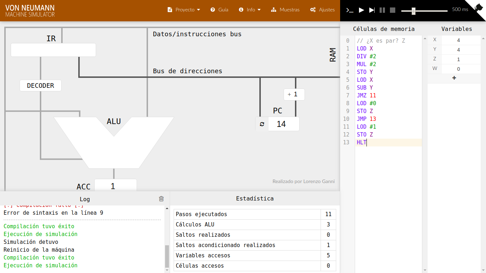
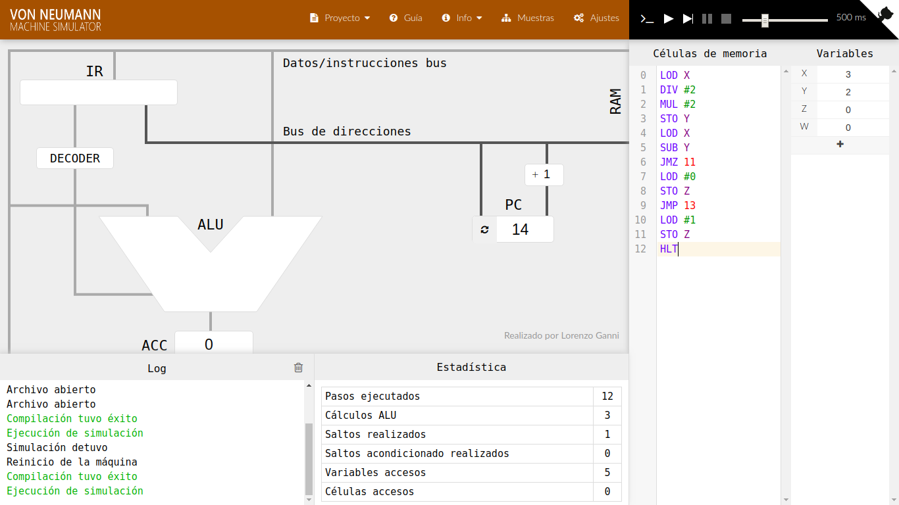

[`Introducción a la Programación`](../README.md) > `Sesión 2`

## Sesión 2: *Von Neumann Simulador* II

### 1. Objetivos :dart:

- Escribir programas que hagan uso de saltos a través del simulador *Von Neumann Simulator* para apreciar el procesamiento de instrucciones de manera visual.

### 2. Contenido :rocket:

---
#### <ins>Instrucciones de salto</ins>


Los ejemplos que revisamos durante la Sesión 1, fueron ejecutados de forma secuencial, es decir, una instrucción después de la otra. Sin embargo, por lo general, un programa no es tan sencillo.

Para cambiar el flujo de ejecución, los lenguajes ensambladores incluyen *instrucciones de salto* que permiten pasar entre instrucciones que no necesariamente se encuentran una después de la otra.

En el *Von Neumann Simulator* tenemos dos tipos de saltos.

1. Salto condicional. Salta a una instrucción si su valor es cero.
1. Salto incondicional. Salta a la instrucción indicada sin verificar ninguna condición.

- [**`EJEMPLO 1`**](ejemplo01/README.md)

---

### 3. Actividad :memo:
Aplica lo todo lo que aprendiste durante la sesión en esta actividad. 

- [**`ACTIVIDAD 2`**](actividad/README.md)

[`Anterior`](../README.md) | [`Siguiente`](../sesion02/README.md)

<!--1. Ingresa a la página del simulador.
   
2. En esta sesión, escribiremos un programa que decida si un número es par. Para saber si un número es par, se deben seguir los siguientes pasos, usaremos los números 3 y 4 como ejemplo:

   1. Dividir el número entre 2.
   
      ```
      4 / 2 = 2
      3 / 2 = 1
      ```
   
   2. Multiplicar el resultado obtenido entre 2.
   
      ```
      2 * 2 = 4
      1 * 2 = 2
      ```
     
   3. Si el valor obtenido es igual al original, devolvemos un 1 (verdadero), si no lo es, devolvemos falso. 
   
      ```
      2 =  2 => 1
      2 /= 3 => 0
      ```
      
      Una forma de ver si dos números son iguales es restalos y verificar que su valor sea cero.
      
      ```
      2 - 2 = 0 => 1
      3 - 2 = 1 => 0
      ```
      
3. El programa que realiza esto en el simulador se muestra a continuación, asegurate de entender cada paso. 

   - La operación `JMZ` recibe un número de línea, de esta forma, si el valor del acumulador es igual a cero (*zero*), salta a la línea indicada. En caso contrario, continúa en la siguiente línea.
   
   - La operación `JMP` recibe un número y simplemente salta a la línea indicada sin verificar ninguna condición.
   
      ```assembly
      // ¿X es par? Z
      LOD X
      DIV #2
      MUL #2
      STO Y
      LOD X
      SUB Y
      JMZ 11
      LOD #0
      STO Z
      JMP 13
      LOD #1
      STO Z
      HLT
      ```
   
4. Ejecuta el código en el simulador y observa el comportamiento. Puedes descargar el código final [aquí](codigos/even.json) y cargarlo en el simulador, pero asegurate de entenderlo. Por atención a la ejecución de los saltos y observa el valor final de `Z`.

   
   
   

[`Anterior`](../actividad01/README.md) | [`Siguiente`](../actividad02/README.md)  --> 
