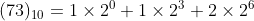

[`Introducción a la Programación`](../README.md) > `Sesión 2`

## Sesión 2: Descifrando mensajes


La representación de la información en una computadora depende del tipo de dado que se va a almacenar en la misma; no es
lo mismo representar un número entero que representar un número flotante o un caracter. 

En esta sesión repasaremos la representación de caracteres en una computadora usando el código ASCII mediante la 
transformación de los códigos correspondientes en decimal a binario y viceversa. Para ello realizaremos un ejercicio
práctico que consiste en descifrar un mensaje representado en binario.

### :dart: <ins>Descifrando un mensaje</ins>

Comenzaremos descifrando un mensaje dado en binario. El mensaje es el siguiente:

```
01001001 01101110 01110100 01110010 01101111 01100100 01110101 01100011 01100011 01101001 10100010 01101110 
00100000 01100001 00100000 01101100 01100001 00100000 01010000 01110010 01101111 01100111 01110010 01100001 
01101101 01100001 01100011 01101001 10100010 01101110
```

1. El primer paso consiste en convertir cada número representado en binario a su correspondiente representación decimal.
   Para ello, debemos representar cada número en notación posicional mediante potencias de dos.

   

   Por ejemplo, para el primer número, tenemos *n = 0*, *m = 8*:

   

1. Una vez convertidos todos los números, obtenemos:

   ```
   73 110 116 114 111 100 117 99 99 105 162 110 32 97 32 108 97 32 80 114 111 103 114 97 109 97 99 105 162 110
   ```

   Estos números representa los códigos ASCII mediante los cuales fue generada la palabra. Así que procedemos a 
   buscarlos a continuación se muestra la Tabla de código ASCII:

   

   Por ejemplo, el primer número 72, representa a la letra `I`.

1. Una vez convertidos todos los números, obtenemos la siguiente oración:

   ```
   Introducción a la Programación
   ```

### :dart: <ins>Cifrando un mensaje</ins>

Ahora realizaremos el proceso inverso. Para ello, necesitamos primero un mensaje que cifrar. Por ejemplo:

```
Conversión a binario
```   

1. Usando la tabla ASCII debemos encontrar el código que representa a cada letra, por ejemplo, para el primer caracter
   `C` tenemos el código `67`

1. Una vez convertidos todos los caracteres, obtenemos:

   ```
   67 111 110 118 101 115 162 110 32 98 105 110 97 114 105 111
   ```

1. Ahora procedemos a convertir el número a binario. Para ello debemos dividir sucesivamente el número entre dos e ir
   acumulando el valor de los residuos hasta que el resultado de la división sea cero. Por ejemplo, para el primer
   número `67`, tenemos:

   

   Al leer el número de abajo hacia arriba y añadiendo ceros para completar ocho bits, tenemos: `01000011`.

1. Una vez convertidos todos los códigos, obtenemos:

   ```
   01000011 01101111 01101110 01110110 01100101 01110011 10100010 01101110 00100000 01100010 01101001 01101110 
   01100001 01110010 01101001 01101111 
   ```

---

> :rocket: **Actividad**   
Busca a otro compañero de clase, cifren cada uno un mensaje e intercambienlo para descifran cada uno el mensaje oculto.
Usa los métodos vistos en esta sesión.

---

[`Anterior`](../sesion01/README.md) | [`Siguiente`](../sesion03/README.md)
