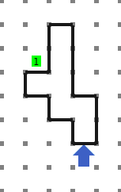
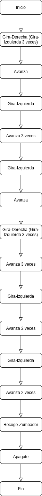

[`Introducción a la Programación`](../README.md) > `Sesión 3`

## Sesión 3: Diseño de algoritmos con __Karel__

### 1. Objetivos :dart:

- Dar la solución a un problema usando la Metodología de Solución de Problemas vista en clase.
- Codificar la solución en un lenguaje sencillo como lo es el simulador Karel.

### 2. Requisitos:blue_book:

1. Notas de clase disponibles en la [Página del curso](https://sites.google.com/view/uacmip20201/material).
1. Página del simulador: [Karel](https://omegaup.com/karel.js/)

### 3. Desarrollo :rocket:

En esta sesión resolveremos un problema por medio de la Metodología de Solución de Problemas que vimos en clase, mediante cada una de sus fases.

##### 1. Definición del problema

Dado el siguiente mundo, escribir un programa para que Karel llegue al zumbador correspondiente.



##### 2. Análisis de la solución del problema

- Entrada: Mundo inicial. Karel se encuentra orientado al norte en la parte inferior de la figura.

- Salida: Mundo final. Karel se encuentra orientado al sur en la posición donde se encuentra el zumbador.

- Proceso: Rodear la figura hasta llegar al zumbador.

##### 3. Diseño de la solución del problema

**Algoritmo**

1. Inicio
2. Gira-Derecha (Gira-Izquierda 3 veces)
3. Avanza
4. Gira-Izquierda
5. Avanza 3 veces
6. Giza-Izquierda
7. Avanza
8. Gira-Derecha (Gira-Izquierda 3 veces)
9. Avanza 3 veces
10. Gira-Izquierda
11. Avanza 2 veces
12. Gira-Izquierda
13. Avanza 2 veces
14. Recoge-Zumbador
15. Apagate
16. Fin

**Diagrama de flujo**



**Prueba de escritorio**

Verificar en papel y lapiz que el algoritmo es correcto

##### 4. Desarrollo de la solución del problema

Implementación en el simulador de Karel.

Para implementar el algoritmo en Karel, usaremos la versión de __Java__. Las siguientes son operaciones equivalentes con el algoritmo en pseudocódigo dado.

| Pseudocódigo    | Karel          |
| --------------- | -------------- |
| Avanza          | `move()`       |
| Gira-Izquierda  | `turnleft()`   |
| Recoge-Zumbador | `pickbeeper()` |
| Deja-Zumbador   | `putbeeper()`  |
| Apagate         | `turnoff()`    |

Para repetir instrucciones se usa la estructura `iterate`. Por ejemplo, para avanzar 5 veces:

```java
iterate(5) {
   move();
}
```

Nota que cada instrucción se separa por punto y coma.

A continuación se muestra la solución al problema dado.

```java
class program {
    program () {
        iterate(3) {
           turnleft();
        }
        move();
        turnleft();
        iterate(3) {
           move();
        }
        turnleft();
        move();
        iterate(3) {
           turnleft();
        }
        iterate(3) {
           move();
        }
        turnleft();
        iterate(2) {
           move();
        }
        turnleft();
        iterate(2) {
           move();
        }
        pickbeeper();
        turnoff();
    }
}
```

Puedes descargar el código y el mundo para probar la solución en el simulador [aquí](codigos/). 

- Para cargar el mundo haz clic en el botón `Mundo` y selecciona la opción `Abrir .in`.
- Para cargar el código haz clic en el botón `Código` y selecciona la opción `Abrir`.
