[`Introducción a la Programación`](../README.md) > `Sesión 3`

## Sesión 3: Metodología de Solución de Problemas

Escribir un programa es una labor difícil y tediosa si no se hace de forma adecuada y bien estructurada. La Ingeniería
de Software se encarga de definir metodologías que permitan garantizar el desarrollo de sistemas libres de errores. Al
ser un curso introductorio, en Introducción a la Programación, revisaremos una Metodología de Solución de Problemas
simple que quizá no aplica formas de trabajo que se usan en la actualidad, pero permiten entender cómo se estructuran
los programas fase por fase.

La Metodología que usaremos en este curso se compone de:

1. Definición del problema
2. Análisis del problema
3. Diseño de la solución del problema
4. Desarrollo de la solución del problema

En esta sesión desarrollaremos una metodología con el apoyo de una herramienta llamada DFD, disponible para Windows. 
Esta herramienta funciona como un intérprete de Diagramas de Flujo, de forma que podemos probar nuestros diseños sin
necesidad de implementarlos en un lenguaje de programación.

---

> :arrow_down: **Descarga.**    
Descarga FreeDFD en la siguiente liga: https://www.softonic.com/descargar/dfd/windows/post-descarga si tienes dudas de 
cómo instalarlo, pregunta a tu profesor. 

---

> :rocket: **Actividad.**   
Una ves descargado el archivo, descomprimelo y coloca la carpeta en el lugar que gustes. Al abrirla encontrarás un 
archivo `dfd-espanol`, haz doble clic sobre él para ejecutar la aplicación.

---

A lo largo de esta sección, resolveremos el siguiente problema, empleando la Metodología:

--- 

> :warning: **Problema.**   
Al llegar a un hotel nos han dado un mapa con los lugares de interés de la ciudad, y nos han dicho que 5 centímetros del 
mapa representan 600 metros de la realidad. Hoy queremos ir a un parque que se encuentra a 8 centímetros del hotel en 
el mapa. ¿A qué distancia del hotel se encuentra este parque?

---

### :dart: <ins>Definición del problema</ins>

La definición del problema debe proporciona de forma clara la entrada del programa, su salida y el problema a resolver
como tal. En este caso, el problema de forma concreta es:

*Escribir un programa que dada la distancia en centímetros del hotel a otro lugar, representada en un mapa, indique la 
distancia real del mismo en metros.*

### :dart: <ins>Análisis de la solución del problema</ins>

En esta etapa identificamos la entrada, salida y proceso del problema a resolver y en caso de ser necesario posibles
fórmulas u subprocesos requeridos.

- **Entrada:** Distancia en centímetros.

- **Salida:** Distancia proporcional en metros.

- **Proceso:**

   1. Pedir distancia al usuario
   1. Calcular la proporción (5cm equivale a 600m)
   1. Mostrar resultados

- **Fórmulas:**

   1. Regla de tres simple.

      

### :dart: <ins>Diseño de la solución del problema</ins>

En esta etapa diseñaremos dos modelos: un algoritmo y un diagrama de flujo. Recuerda que un algoritmo especifica paso
a paso cómo resolver un problema y cada uno de estos pasos es libre de ambigüedades, mientras que el diagrama de flujo
proporciona una representación gráfica del algoritmo.

#### Algoritmo

1. Inicio
1. Imprimir "Introduce la distancia en centímetros: "
1. Leer `cm`
1. `m = (cm * 600) / 5`
1. Imprimir "La ubicación se encuentra a " + `m` + "metros de distancia"
1. Fin

#### Diagrama de flujo

Para agregar elementos en el diagrama, usaremos los íconos que se encuentran en la parte superior. Los diagramas de 
flujo siempre inician con un símbolo de inicio y fianlizan con uno de fin, al igual que los algoritmos. Inicialmente
verás la siguiente pantalla:

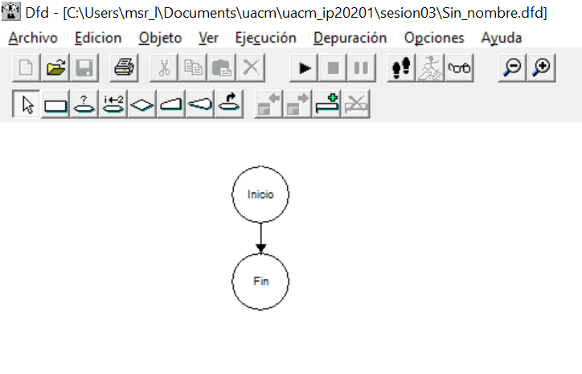

A partir de este punto se construye el diagrama:

1. Añadiremos la impresión del paso 2 del algoritmo. Para ello, en los íconos de la parte superior, elegimos el 
correspondiente a salida y damos clic en la posición del diagrama en la que queremos que se coloque.

   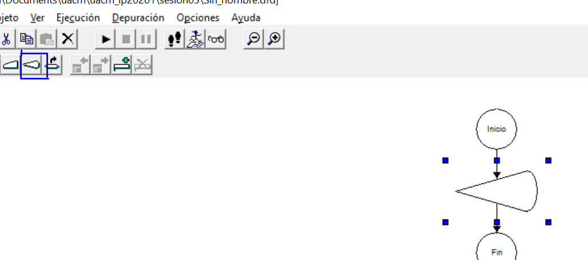

1. Damos doble clic en el símbolo que apareció sobre el diagrama e introducimos el mensaje a mostrar (con comillas): 
`'Introduce la distancia en centímetros: '`, posteriormente damos clic en `[Aceptar]`.

   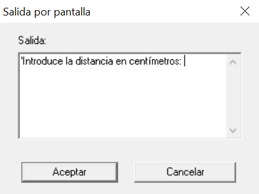

1. Ahora añadimos la lectura de `cm` que representa a una variable. Elegimos el ícono de Lectura y lo colocamos justo
después del símbolo anterior.

   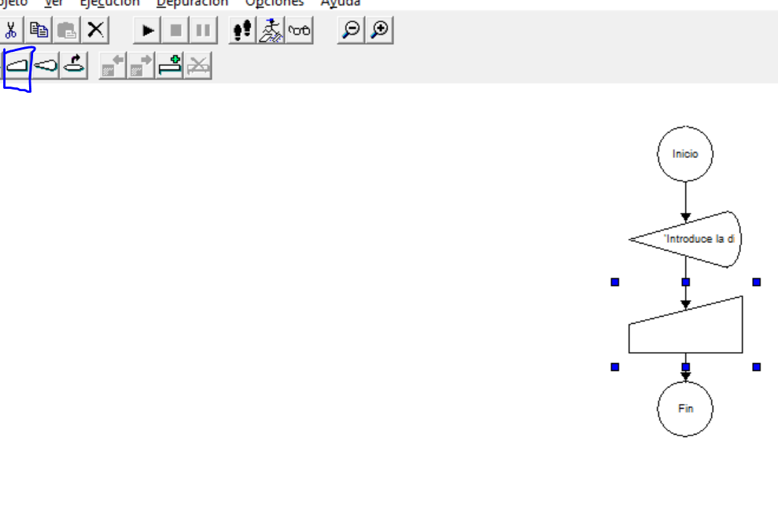

1. Damos doble clic en el símbolo que apareció sobre el diagrama e introducimos la variable a leer: `cm`, posteriomente
damos clic en `[Aceptar]`.

   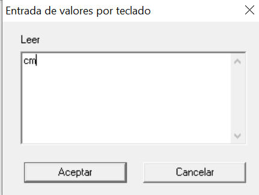

1. Ahora añadimos la instrucción que aplica la regla de tres. Elegimos el ícono de Asignación y lo colocamos justo
después del símbolo anterior.

   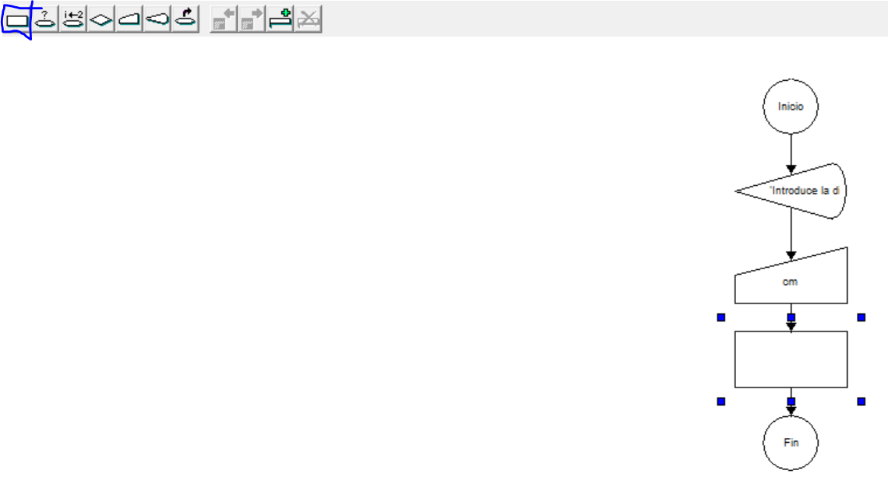

1. Damos doble clic en el símbolo que apareció sobre el diagrama e introducimos la asignación de la variable `m` como:
`(cm * 600) / 5`, posteriormente damos clic en `[Aceptar]`.

   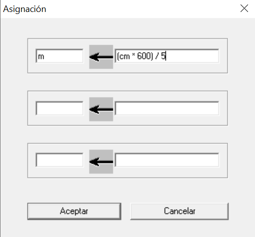

1. Finalmente volvemos a añadir una Salida, que incluya la variable recién asignada. Para agregar variables a un mensaje
usamos comas: `La ubicación se encuentra a ',m,'metros de distancia'`.

   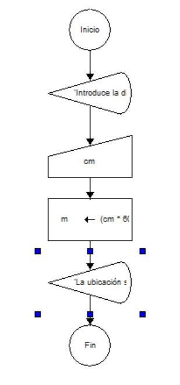

1. Finalmente, damos clic en el botón de ejecutar :arrow_forward: y seguimos las instrucciones correspondientes. Por
ejemplo, para 8 centímetros. Presionamos continuar en cada paso.

   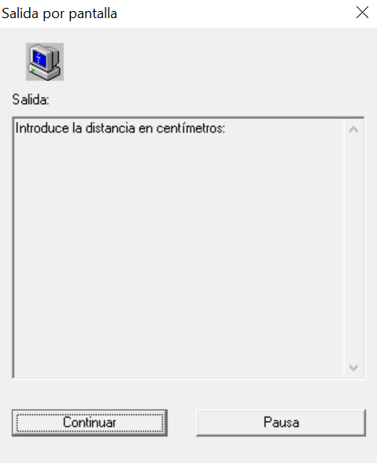
   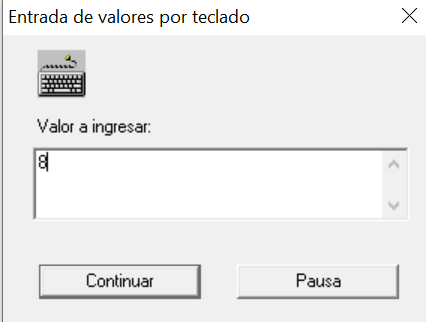
   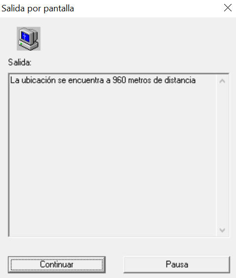

---

> :rocket: **Actividad.**   
Replica el ejemplo anterior y juega con los símbolos de DFD, muestra otras impresiones, ingresa otras variables, trata
de resolver otros problemas con esta herramienta, recuerda primero definir el algoritmo. Puedes descargar el diagrama
final aquí: [**`diagrama.dfd`**](codigos/diagrama.dfd)

---

### :dart: <ins>Desarrollo de la solución de problemas</ins>

En esta fase debemos llevar el diseño de la solución a un lenguaje de programación de alto nivel como C. Veremos esto
más adelante.

[`Anterior`](../sesion02/README.md) | [`Siguiente`](../sesion04/README.md)
