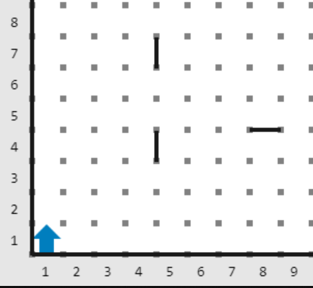
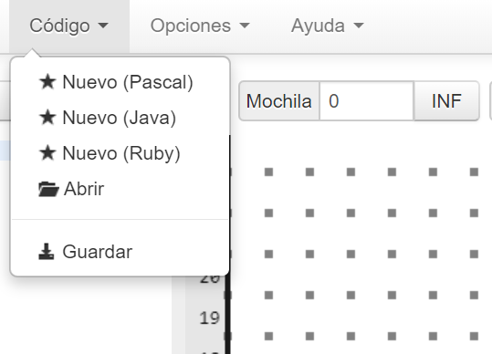
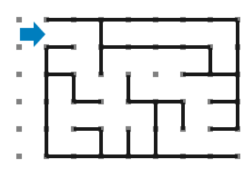

[`Introducción a la Programación`](../README.md) > `Sesión 4`

## Sesión 4: Karel


Programar en un lenguaje de programación de alto nivel es un proceso riguroso y que requiere de mucha paciencia y 
experiencia por parte del programador. Para conocer estos conceptos iniciaremos programando al Robot __Karel__. Es una
herramienta de aprendiza que presenta los conceptos más elementales de la programación de forma visual, lo cual es menos
abstracto que programar en un lenguaje como __C__.

### :dart: <ins>El mundo de Karel</ins>

__Karel__ es un robot que vive en un *mundo* compuesto de *calles* (horizontales) y *avenidas* (verticales). A la
intersección de una avenida con una calle, le llamamos *esquina*. Es posible colocar muros en las calles o avenidas,
simplemente dando clic en el lugar deseado.



---
> :rocket: **Actividad.**   
Entra al simulador de __Karel__: https://omegaup.com/karel.js/ y explora el mundo de __Karel__. Trata de colocar y 
quitar muros. Para quitar un muro, simplemente da clic sobre él.

---

### :dart: <ins>Instrucciones básicas</ins>

Para mover a __Karel__ a través de su mundo, tenemos algunas instrucciones básicas:

- Para indicarle que de un paso, usamos `move()`.
- Para indicarle que gire a la izquierda, usamos `turnleft()`.
- Para indicarle que tome un zumbador de su mochila y lo coloque en la posición actual, usamos `putbeeper()`.
- Para indicarle que tome un zumbador de la posición actual y lo coloque en su mochila, usamos `pickbeeper()`.
- Para indicarle que se apague, usamos `turnoff`.

Los zumbadores son objetos que Karel puede reconocer dentro de su mundo, además de los muros. Debes tener especial 
cuidado tanto con los muros como con los zumbadores, si intentas que __Karel__ intente pasar por una calle o avenida
donde se encuentra un muro o si intentas tomar un zumbador de la posición actual o de la mochila y no existen zumbadores
obtendrás un error.

Para hacer que __Karel__ ejecute algunas de estas instrucciones, usaremos el editor que se encuentra a la derecha.
En este curso usaremos la versión de __Java__ por su similutud con __C__. Para ello, cambia el lenguaje desde el menú
`Código` en la parte superior.



---

> :rocket: **Actividad.**   
Cambia el código a __Java__ y escribe algunos de los comandos antes mencionados, aprecia qué hace __Karel__ con ellos.
Intenta poner zumbadores en su mochila y deja algunos en el mundo (dando clic en la esquina correspondiente) y observa
el comportamiento de __Karel__. ¿Cómo podrías indicarle a __Karel__ que gire a la derecha?

---

### :dart: <ins>Laberintos</ins>

Ahora, resolverás tu primer problema usando el lenguaje de __Karel__. Recuerda que antes escribir cualquier programa,
debes analizarlo mediante la Metodología de Solución de Problemas.

---

> :warning: **Problema.**   
Dado el siguiente estado del mundo de __Karel__, indicarle al robot las instrucciones necesarias para que llegue a la
salida del laberinto.   
>    
> [**`mundo.in`**](codigos/mundo.in)   
> 

---

> :rocket: **Actividad.**   
Usando la metodología de solución de problemas, diseña la solución al problema anterior. Recuerda, debes dar:
>
> - Definición del problema.
> - Análisis del problema.
> - Diseño de la solución del problema (algoritmo, diagrama de flujo).

---

Una posible solución al problema anterior, se muestra a continuación. Date cuenta cómo después de cada instrucción debe
colocarse un punto y coma `;`. Los programas en __Karel__ se deben colocar entre un bloque llamado `class program` que
a su vez contiene un bloque `program()`. Para finalizar un programa debemos apagar el robot con `turnoff`.

[**`solucion.txt`**](codigos/solucion.txt)
```java
class program {
    program () {
       move();
       move();
       turnleft();
       turnleft();
       turnleft();
       move();
       move();
       turnleft();
       move();
       turnleft();
       move();
       turnleft();
       turnleft();
       turnleft();
       move();
       move();
       turnleft();
       turnleft();
       turnleft();
       move();
       turnleft();
       move();
       turnleft();
       turnleft();
       turnleft();
       move();
       move();
       turnleft();
       move();
       move();
       turnoff();
    }
}
```

---

> :rocket: **Actividad.**   
Ejecuta el código anterior, observa los resultados. Modificalo y observa los cambios. Puedes también cambiar el 
laberinto y cambiar el código para que se adapte a nuevas versiones.

---

[`Anterior`](../sesion03/README.md) | `Siguiente`
