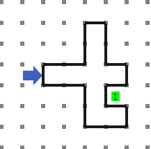

[`Introducción a la Programación`](../../README.md) > [`Sesión 03`](../README.md) > `Actividad`

## Actividad 1: Diseño de algoritmos con Karel

### OBJETIVO

- Poner en práctica lo aprendido sobre la Metodología de Solución de Problema para resolver un problema usando Karel.

#### REQUISITOS

1. Página del simulador: [Karel](https://omegaup.com/karel.js)

#### DESARROLLO

Dado el siguiente mundo, escribir un programa para que Karel llegue al zumbador correspondiente.

Puedes descargar el mundo [aquí](codigos/mundo.in).
