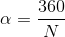

[`Introducción a la Programación`](../../README.md) > [`Sesión 05`](../README.md) > `Actividad`

## Actividad: Apotema de una figura

### OBJETIVO

- Poner en práctica lo aprendido sobre las operaciones de entrada y aritmética en __C__.

#### REQUISITOS

1. Compilador __DevC++__.

#### DESARROLLO

El apotema de un polígono regular es la distancia más corta entre su centro y cada uno de sus lados. Puede calcularse a partir del número de lados del polígono y lo que mide cada uno de éstos.

Primero es necesario encontrar el *ángulo central* al que llamamos alfa. Para ello dividiremos 360 grados entre el número de lados de la figura.



Una vez calculado el ángulo central, obtendremos el apotema dividiendo el tamaño de los lados entre el doble de la tangente del ángulo central entre dos. Es decir:


La actividad consiste en escribir un programa que dado el número de lados de un polígono regular y el tamaño de sus lados calcule el apotema del mismo. Un ejemplo se ejecución sería:

```bash
Introduce el número de lados: 5
Introduce el tamaño de los lados: 10

El valor del apotema es: 6.89
```
