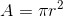

[`Introducción a la Programación`](../../README.md) > [`Sesión 05`](../README.md) > `Ejemplo 01`

## Ejemplo 1: Operaciones de salida y aritmética

Adicional a las operaciones de salida que revisamos en la sesión pasada, __C__ cuenta con operaciones de salida que también se encuentran dentro de la biblioteca `stdio.h`. Para ejemplificar el uso de estas funciones, definiremos paso a paso un programa que calcule el área de un círculo a partir de un radio ingresado por el usuario. La fórmula para calcular el área de un círculo es: 



### 1. Importando biblioteca de entrada y salida

Como siempre, lo primero será importar la biblioteca estándar de entrada y salida. Para ello, agregamos la siguiente instrucción al inicio de nuestro programa.

```c
#include <stdio.h>
```

### 2. Definición de la función `main`

Para que nuestro programa se pueda ejecutar, debemos incluir la definición de la función `main`. Recuerda que el cuerpo de la función, va delimitado por llaves y que debe incluir la instrucción `return 0` para indicar que todo finalizó correctamente. También añadimos algunos comentarios para hacer más claro el objetivo del programa.

```c
/* Programa que calcula el área de un círculo a partir
   del radio ingresado por el usuario. */

int main(void)
{
  return 0;
}
```

### 3. Declaración de variables

Pediremos al usuario el radio del círculo, por lo tanto necesitamos una variable. En este caso la variable debe ser de tipo flotante (`float`) pues el radio de un círculo puede ser expresado con partes fraccionarias. También necesitaremos declarar una variable para el resultado, así que nuestra declaración queda como:

```c
// Declaración de variables
float radio;
float area;
```

Recuerda que existen otros tipos de datos de __C__, la siguiente tabla muestra algunos de estos tipos de datos.

| Tipo     | Descripción                |
| -------- | -------------------------- |
| `short`  | Números enteros pequeños   |
| `int`    | Números enteros medianos   |
| `long`   | Números enteros grandes    |
| `float`  | Números flotantes pequeños |
| `double` | Números flotantes grandes  |
| `char`   | Caracteres                 |

Más adelante veremos a qué se refieren las palabras pequeño, mediano y grande.

### 4. Pedir los datos al usuario

Dado que el usuario sólo ingresará un número, únicamente pediremos dicho valor. Primero debemos pedir el dato mostrando un mensaje en pantalla con el uso de `printf` y después debemos leerlo del teclado usando `scanf`. La función `scanf`, requiere dos cosas para funcionar:

1. Un especificador de formato que le indica el tipo de dato que va a recibir. Los especificadores de formato para cada tipo de dato son:

   | Tipo     | Especificador |
   | -------- | ------------- |
   | `short`  | `%hd`         |
   | `int`    | `%d`          |
   | `long`   | `%ld`         |
   | `float`  | `%f`          |
   | `double` | `%lf`         |
   | `char`   | `%c`          |
   
2. Una dirección en memoria dónde almacenar el dato que se ingrese desde el teclado. Dado que vamos a guardar ese dato en variables, necesitamos indicarle a `scanf` la dirección en memoria de nuestra variable, para obtener dicha dirección se usa el símbolo `&` con lo cual en lugar de hacer referencia a la variable, estamos obteniedo su dirección en memoria.

De esta forma, para pedir los datos añadimos las siguientes líneas a nuestra función `main`.

```c
// Pedir datos al usuario
printf("Introduce el radio del círculo: \n");
scanf("%f", &radio);
```

Usamos el especificador `%f` pues recibiremos un número flotante y lo almacenaremos en la dirección de memoria de la variable `radio` por lo cual escribimos `&radio`.

### 5. Calcular el área

Ahora calcularemos el área y la guardaremos en la variable `area`, con lo cual traduciremos la fórmula anterior. Podriamos calcular el valor de *pi* pero queda fuera de los objetivos de este curso, así que ocuparemos una biblioteca que tenga esta definición.

La biblioteca `math.h` incluye varias funciones y constantes que harán nuestra vida más fácil al momento de hacer cálculos simples y complejos. Para incluir esta biblioteca, añadiremos la línea `#include <math.h>` justo abajo de la importación de la biblitoeca de entrada y salida.

```c
#include <stdio.h>
#include <math.h>
```

Puedes consultar las funciones de esta biblitoteca [aquí](https://www.geeksforgeeks.org/c-library-math-h-functions/).

Nosotros simplemente usaremos la definición de *pi* mediante la constante `M_PI` y usaremos la función `pow` que permite elevar un número a una potencia, en este caso, elevaremos `radio` al cuadrado. De esta forma el cálculo queda como sigue:

```c
// Cálculo del área
area = M_PI * pow(radio,2);
```

#### 5. Mostrar los resultados al usuario

Ahora mostraremos los resultados al usuario, para ello usaremos `printf` con un especificador de formato. Los especificadores de formato son útiles para añadir el valor de variables a las cadenas mostrada por `printf`. 

Para ello, se debe colocar un especificador de formato en la posición de la cadena donde queremos que se muestre el valor de la variable y colocaremos una coma después de la cadena, proporcionando las variables en el orden en que se fueron colocando los especificadores de formato.

Para nuestro ejemplo, queremos mostrar un mensaje `"El resultado es:"` y colocar el valor de la variable `area`. Dado que `area` es de tipo flotante, colocaremos un especificador `%f` y agregaremos la variable `area` a los argumentos de `printf`.

```c
// Mostrar resultados
printf("\nEl resultado es: %f", area);
```

### Código final

El programa final queda como sigue:

```c
#include <stdio.h>
#include <math.h>

/* Programa que calcula el área de un círculo a partir
   del radio ingresado por el usuario. */

int main(void)
{
  // Declaración de variables
  float radio;
  float area;
  
  // Pedir datos al usuario
  printf("Introduce el radio del círculo: \n");
  scanf("%f", &radio);
  
  // Cálculo del área
  area = M_PI * pow(radio,2);
  
  // Mostrar resultados
  printf("\nEl resultado es: %f", area);
  
  system("pause"); // Para DevC++
  return 0;
}
```

Ejemplo de ejecución:

```bash
Introduce el radio del círculo: 5

El resultado es: 78.539818
```

Puedes descargar el código [aquí](codigos/Area.c).
