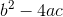
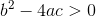
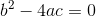
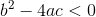

[`Introducción a la Programación`](../README.md) > `Sesión 6`

## Sesión 6: Estructuras de decisión


### 1. Objetivos :dart:

- Repasar la sintaxis de las principales estructuras de decisión del lenguaje de programación __C__.
- Escribir programas que hagan uso de estructuras de decisión.

### 2. Requisitos :blue_book:

1. Notas de clase disponibles en la [Página del curso](https://sites.google.com/view/uacmip20201/material).
1. Compilador de __C__.

### 3. Desarrollo :rocket:

Escribiremos distintos programas que ejemplifiquen el uso de las estructuras.

---

#### Ejemplo 1
Se ingresa por teclado un número entero. Mostrar por pantalla un mensaje que indique si el número es positivo, negativo
o cero.

*Solución:*

**Definición del problema**   
Es clara.

**Análisis del problema**   
- Entrada: Un número entero.
- Salida: Mensaje indicando si el número es negativo, positivo o cero.
- Proceso:
   - Pedir el número al usuario.
   - Decidir si es negativo, positivo o cero.
   - Mostrar resultados.

**Diseño de la solución del problema**   
*Algoritmo*

1. Inicio
2. Imprimir "Introduce un número entero: "
3. Leer n
4. Si n es menor a cero, Imprimir "El número es negativo", si no, ve al paso 5
5. Si n es igual a cero, Impirmir "El número es cero", si no, ve al paso 6
6. Si n es mayor a cero, Imprimir "El número es positivo", si no, ve al paso 7
7. Fin

**Desarrollo de la solución del problema**   
*Implementación en el lenguaje __C__*

```c
#include <stdio.h>

int main(void)
{
	// Declaración de variables.
	int n;

	// Pedir datos al usuario.
	printf("Introduce un número entero: ");
	scanf("%d", &n);

	// Mostrar resultados.
	if (n < 0)
		printf("\nEl número es negativo\n");
	if (n == 0)
		printf("\nEl número es igual a cero\n");
	if (n > 0)
		printf("\nEl número es positivo\n");

	return 0;
}
```

---


#### Ejemplo 2
En la fórmula general, la cantidad



es llamada *discriminante* de la ecuación y determina la naturaleza de las raíces de acuerdo a lo siguiente:

- Si es mayor a cero, las raíces son reales y diferentes.

   

- Si es igual a cero, las raíces son reales e iguales.

   

- Si es menor a cero, las raíces son complejas conjugadas.

   

Escribir un programa que dados los valores para `a`, `b` y `c`, calcule el discriminante correspondiente y muestre en pantalla el tipo de raíces.

*Solución:*

**Definición del problema**   
Es clara.

**Análisis del problema**
- Entrada: Los valores `a`, `b` y `c` de una ecuación de segundo grado.
- Salida: Mensaje explicativo del tipo de raíces de la ecuación.
- Proceso:
   - Pedir datos al usuario.
   - Calcular discriminante.
   - Analizar los casos y mostrar el mensaje correspondiente.
- Fórmulas:   
   

**Diseño de la solución del problema**   
*Algoritmo*

1. Inicio
1. Imprimir "Introduce el valor de a: "
1. Leer a
1. Imprimir "Introduce el valor de b: "
1. Leer b
1. Imprimir "Introduce el valor de c: "
1. Leer c
1. discriminante <- `b*b - 4*a*c`
1. Si discriminante > 0, Imprimir "Las raíces son reales y diferentes". Si no, ir al paso 10.
1. Si discriminante = 0, Imprimir "Las raíces son reales e iguales." Si no, ir al paso 11.
1. Si discriminante < 0, Imprimir "Las raíces son complejas y conjugadas." Si no, ir al paso 12.
1. Fin

**Desarrollo de la solución del problema**   
*Implementación en el lenguaje __C__*

```c
#include <stdio.h>
#include <math.h>

int main(void)
{
	// Declaración de variables.
	float a;
	float b;
	float c;
	float discriminante;

	// Pedir datos al usuario.
	printf("Introduce el valor de a: ");
	scanf("%f", &a);
	printf("Introduce el valor de b: ");
	scanf("%f", &b);
	printf("Introduce el valor de c: ");
	scanf("%f", &c);

	// Calcular discriminante.
	discriminante = pow(b,2) - (4*a*c);

	// Mostrar resultados.
	if (discriminante > 0.0)
		printf("\nLas raíces son reales y diferentes\n");
	if (discriminante == 0.0)
		printf("\nLas raíces son reales e iguales\n");
	if (discriminante < 0.0)
		printf("\nLas raíces son complejas y conjugadas\n");

	return 0;
}
```

---

#### Ejemplo 3
Realizar un programa que solicite dos números, si el primero es mayor al segundo mostrar su suma y resta, en caso 
contrario informar el producto y la división del primero respecto al segundo.

**Definición del problema**   
Es clara.

**Análisis del problema**   
- Entrada: Dos números.
- Salida: Resultado de la operación correspondiente.
- Proceso:
   - Pedir datos al usuario.
   - Decidir qué operación realizar.
   - Mostrar resultados al usuario.

**Diseño de la solución del problema**   
*Algoritmo*

1. Inicio
2. Imprimir "Introduce el primer número: "
3. Leer n1
4. Imprimir "Introduce el segundo número: "
5. Leer n2
6. Si n1 > n2, ve al paso 7, si no, ve al paso 11
7. suma = n1 + n2
8. resta = n1 - n2
9. Imprimir "Suma " + suma + " Resta: " + resta
10. Ir al paso 14.
11. multi = n1 * n2
12. divi = n1 / n2
13. Imprimir "Multiplicación " + multi + " División: " + divi
14. Fin

**Desarrollo de la solución del problema**   
*Implementación en el lenguaje __C__*

```c
#include <stdio.h>

int main(void)
{
	// Declaración de variables.
	int n1;
	int n2;

	// Pedir datos al usuario.
	printf("Introduce el primer número: ");
	scanf("%d", &n1);
	printf("Introduce el segundo número: ");
	scanf("%d", &n2);

	// Decidir operación.
	if (n1 > n2)
	{
		printf("\nSuma: %d\n", n1+n2);
		printf("\nResta: %d\n", n1-n2);
	} else
	{
		printf("\nMultiplicación: %d\n",n1*n2);
		printf("\nDivisión: %d\n", n1/n2);
	}

	return 0;
}
```

[`Anterior`](../actividad05/README.md) | [`Siguiente`](../actividad06/README.md)
