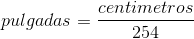
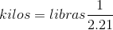

[`Introducción a la Programación`](../README.md) > `Sesión 7`

## Sesión 7: Estructuras de decisión múltiple


### 1. Objetivos :dart:

- Repasar la sintaxis de la estructura de control `switch` del lenguaje de programación __C__.
- Escribir programas que hagan uso de la estructura de control `switch`.

### 2. Requisitos :blue_book:

1. Notas de clase disponibles en la [Página del curso](https://sites.google.com/view/uacmip20201/material).
1. Compilador de __C__.

### 3. Desarrollo :rocket:

Escribiremos distintos programas que ejemplifiquen el uso de las estructuras.

---

#### Ejemplo 1
Escribir un programa que solicite una fecha al usuario y calcule el día correspondiente del año. Por ejemplo, si se ingresa la fecha 31/12/1998, se debe visualizar el número 365. No se deben tomar en cuenta años bisiestos.

*Solución:*

**Definición del problema**   
Es clara.

**Análisis del problema**   
- Entrada: Tres números enteros (día, mes y año)
- Salida: Día correspondiente del año.
- Proceso:
   - Pedir los números al usuario.
   - A partir del mes, sumar los días necesarios al día pasado por el usuario.
   - Mostrar resultados.

**Diseño de la solución del problema**   
*Algoritmo*

1. Inicio
1. Imprimir "Introduce el día: "
1. Leer d
1. Imprimir "Introduce el mes: "
1. Leer m
1. Imprimir "Introduce el año: "
1. Leer a
1. Según m, hacer:
   - Si m = 1, nd = d
   - Si m = 2, nd = d + 31
   - Si m = 3, nd = d + 59
   - Si m = 4, nd = d + 90
   - Si m = 5, nd = d + 120
   - Si m = 6, nd = d + 151
   - Si m = 7, nd = d + 181
   - Si m = 8, nd = d + 212
   - Si m = 9, nd = d + 243
   - Si m = 10, nd = d + 274
   - Si m = 11, nd = d + 304
   - Si m = 12, nd = d + 334
   - Si no, Imprimir "Fecha no válida"
1. Imprimir "El día " + d + " es el " + nd + "del año " + a
1. Fin

**Desarrollo de la solución del problema**   
*Implementación en el lenguaje __C__*

```c
#include <stdio.h>

int main(void)
{
	// Declaración de variables.
	int d;
	int m;
	int a;
	int nd;

	// Pedir datos al usuario.
	printf("Introduce un día: ");
	scanf("%d", &d);
	printf("Introduce un mes: ");
	scanf("%d", &d);
	printf("Introduce un año: ");
	scanf("%d", $a);

	// Mostrar resultados.
	switch(mes)
	{
		case 1:
			nd = d;
			break;
		case 2:
			nd = d + 31;
			break;
		case 3:
			nd = d + 59;
			break;
		case 4:
			nd = d + 90;
			break;
		case 5:
			nd = d + 120;
			break;
		case 6:
			nd = d + 151;
			break;
		case 7:
			nd = d + 181;
			break;
		case 8:
			nd = d + 212;
			break;
		case 9:
			nd = d + 243;
			break;
		case 10:
			nd = d + 274;
			break;
		case 11:
			nd = d + 304;
			break;
		case 12:
			nd = d + 334;
			break;
		default:
			nd = -1;
	}

	if (nd != -1)
		printf("\nEl día %d es el día %d del año %d\n", d, nd, a);
	else
		printf("\nFecha inválida\n");

	return 0;
}
```

---


#### Ejemplo 2
Escribir un programa que dado un menú de opciones, permita al usuario convertir centímetros a pulgadas (opción 1) o libras a kilogramos (opción 2).

*Solución:*

**Definición del problema**   
Es clara.

**Análisis del problema**
- Entrada: Una opción del menú y de acuerdo a ésta, el valor en centímetros o en libras.
- Salida: Conversión a pulgadas o a kilogramos, según corresponda.
- Proceso:
   - Pedir opción del menú al usuario.
   - Pedir centímetros o libras de acuerdo a la opción elegida.
   - Realizar la conversión correspondiente.
   - Mostrar el resultado.
- Fórmulas:   
      
   

**Diseño de la solución del problema**   
*Algoritmo*

1. Inicio
1. Imprimir "Introduce una opción"
1. Imprimir "[1] Centímetros a pulgadas"
1. Imprimir "[2] Libras a kilogramos"
1. Imprimir "Opción: "
1. Leer opcion
1. Según opcion, hacer:
   - Si opcion = 1:
      - Imprimir "Introduce la distancia en centímetros: "
      - Leer v
      - resultado = v / 254
   - Si opcion = 2
      - Imprimir "Introduce el peso en libras: "
      - Leer v
      - resultado = v * (1 / 2.21)
1. Imprimir "El resultado es: " + resultado
1. Fin

**Desarrollo de la solución del problema**   
*Implementación en el lenguaje __C__*

```c
#include <stdio.h>

int main(void)
{
	// Declaración de variables.
	int opcion;
	float v;
	float resultado;

	// Pedir datos al usuario.
	printf("Introduce una opción\n");
	printf("[1] Centímetros a pulgadas.\n");
	printf("[2] Libras a kilogramos\n")
	printf("Opción: ");
	scanf("%d", &opcion);

	// Realizar cálculos
	switch(opcion)
	{
		case 1:
			printf("\nIntroduce la distancia en centímetros: ");
			scanf("%f", &v);
			resultado = v / 254;
			break;
		case 2:
			printf("\nIntroduce el peso en libras: ");
			scanf("%f", &v);
			resultado = v * (1 / 2.21);
			break;
		default:
			resultado = -1;
	}

	// Mostrar resultados.
	if (resultado != -1)
		printf("\nResultado: %f\n", resultado);
	else
		printf("\nOpción incorrecta.\n");

	return 0;
}
```

---

#### Ejemplo 3
Escribir un programa que permita incrementar los sueldos de una empresa de acuerdo al tipo de contrato:

- Si el contrato es de tipo A (entre $0 y $9,000), incrementarlo en un 20%
- Si el contrato es de tipo B (entre $9,001 y $15,000), incrementarlo en un 10%
- Si el contrato es de tipo C (entre $15,001 y $20,000), incrementarlo en un 5%
- Si el contrato es de tipo D (más de %20,000), incrementarlo en un 3%

**Definición del problema**   
Es clara.

**Análisis del problema**   
- Entrada: Tipo de sueldo y a partir de este el sueldo actual.
- Salida: Sueldo con el aumento correspondiente.	
- Proceso:
   - Pedir el tipo de contrato al usuario.
   - Pedir el tipo de sueldo.
   - Calcular el aumento correspondiente.
   - Mostrar resultados al usuario.

**Diseño de la solución del problema**   
*Algoritmo*

1. Inicio
1. Imprimir "Introduce el tipo de contrato: "
1. Imprimir "[A] Entre $0 y $9,000"
1. Imprimir "[B] Entre $9,001 y $15,000
1. Imprimir "[C] Entre $15,001 y $20,000
1. Imprimir "[D] Más de %20,000"
1. Imprimir "Opción: "
1. Según opcion, hacer:
   - Si opcion = A:
      - Imprimir "Introduce tu sueldo actual: "
      - Leer sueldo
      - aumento = sueldo + (sueldo * 0.2)
   - Si opcion = B
      - Imprimir "Introduce tu sueldo actual: "
      - Leer sueldo
      - aumento = sueldo + (sueldo * 0.1)
   - Si opcion = C
      - Imprimir "Introduce tu sueldo actual: "
      - Leer sueldo
      - aumento = sueldo + (sueldo * 0.05)
   - Si opcion = D
      - Imprimir "Introduce tu sueldo actual: "
      - Leer sueldo
      - aumento = sueldo + (sueldo * 0.03)
1. Imprimir "Aumento: " + aumento

**Desarrollo de la solución del problema**   
*Implementación en el lenguaje __C__*

```c
#include <stdio.h>

int main(void)
{
	// Declaración de variables.
	char opcion;
	float sueldo;
	float aumento;

	// Pedir datos al usuario.
	printf("Introduce el tipo de contrato\n");
	printf("[A] Entre $0 y $9,000\n");
	printf("[B] Entre $9,001 y $15,000\n");
	printf("[C] Entre $15,001 y $20,000\n");
	printf("[D] Más de %20,000");
	scanf("%c", &opcion);

	// Calcular aumento
	switch(opcion)
	{
		case 'A':
			printf("\nIntroduce tu sueldo actual: ");
			scanf("%f", &sueldo);
			aumento = sueldo + (sueldo * 0.2);
			break;
		case 'B':
			printf("\nIntroduce tu sueldo actual: ");
			scanf("%f", &sueldo);
			aumento = sueldo + (sueldo * 0.1);
			break;
		case 'C':
			printf("\nIntroduce tu sueldo actual: ");
			scanf("%f", &sueldo);
			aumento = sueldo + (sueldo * 0.05);
			break;
		case 'D':
			printf("\nIntroduce tu sueldo actual: ");
			scanf("%f", &sueldo);
			aumento = sueldo + (sueldo * 0.03);
			break;
		default:
			aumento = -1;
	}

	if (aumento != -1)
		printf("\nAumento: %f\n", aumento);
	else
		printf("\nOpción incorrecta\n");

	return 0;
}
```

[`Anterior`](../actividad05/README.md) | [`Siguiente`](../actividad07/README.md)
