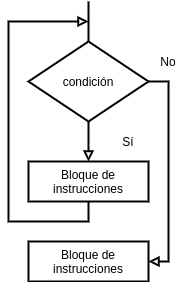

[`Introducción a la Programación`](../README.md) > `Sesión 8`

## Sesión 8: Estructuras de repetición `while` y `do-while`


<div style="text-align: justify;">

### 1. Objetivos :dart:

- Repasar la sintaxis de las estructuras de control `while` y `do-while` del lenguaje de programación __C__.
- Escribir programas que hagan uso de las estructuras de control `while` y `do-while`.

### 2. Contenido :rocket:

---
#### <ins>Estructuras de repetición</ins>


Las estructuras de repetición permite, como su nombre lo dice, repetir instrucciones de acuerdo a la definición de cuatro partes:

1. Inicialización
1. Condición
1. Bloque de instrucciones
1. Actualización

Adicionalmente se apoyan de los operadores de incremento y decremento:

`a++` `++a` `a--` `--a`

También de los operadores de asignacion compuesta:

`+=` `-=` `*=` `/=` `%=`

---
#### <ins>Estructura `while`</ins>


Dada una condición la estructura `while` verifica si ésta es verdadera, ejecuta el bloque de instrucciones y vuelve a revisar la condición. Se repite este proceso *mientras* la condición sea verdadera, en caso contrario la ejecución del bloque de instrucciones finaliza.

La sintaxis de un `while` es la siguiente:

```c
while (condición)
{
	bloque-instrucciones
}
```

La condición debe ser cualquier expresión booleana, en particular, los *operadores relacionales*. El bloque de instrucciones puede ser cualquier instrucción válida de __C__, incluso otra estructura de control.

- [**`EJEMPLO 1`**](ejemplo01/README.md)
- [**`EJEMPLO 2`**](ejemplo02/README.md)

---
#### <ins>Estructura `do-while`</ins>


Funciona como un `while` invertido, es decir, ejecuta un bloque de instrucciones y posteriormente verifica la condición. Se repeite este proceso *mientras* la condición sea verdadera, en caso contrario la dejecución del bloque de instrucciones finaliza.

La sintaxis de un `do-while` es la siguiente:

```c
do
{
	bloque-instrucciones
} while (condición);
```

En esta estructura se garantiza que el bloque de instrucciones es ejecutado al menos una vez.

- [**`EJEMPLO 3`**](ejemplo03/README.md)
- [**`EJEMPLO 4`**](ejemplo04/README.md)

---

### 3. Actividad :memo:
Aplica lo todo lo que aprendiste durante la sesión en esta actividad. 

- [**`ACTIVIDAD 8`**](actividad/README.md)

[`Anterior`](../sesion07/README.md) | `Siguiente`

</div>
