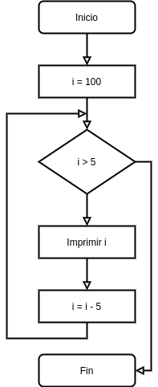

[`Introducción a la Programación`](../README.md) > [`Sesión 8`](../README.md) > `Ejemplo 1`

## Ejemplo 1: Múltiplos de cinco

<div style="text-align: justify;">

### 1. Objetivos :dart:

- Poner en práctica el uso de la estructura de repetición `while`

### 2. Requisitos :clipboard:

1. Compilador de __C__ instalado

### 3. Desarrollo :rocket:

Se requiere escribir un programa en que muestre los múltiplos de cinco menores a 100 de forma decendente. A continuación se muestra la metodología de solución de problemas junto con el código en C.

#### Definición del problema
Es clara.

#### Análisis del problema
- Entrada: Ninguna
- Salida: Múltipos de cinco menores a 100 de forma descendente.
- Proceso: 
   - Inicializar variable de control el 100.
   - Mientras la variable de control sea menor 5, mostrar el múltiplo de 5 más cercano a la variable de control.

#### Diseño de la solución del problema


1. Inicio
1. i = 100
1. mientras i > 5 ve al paso 4, si no, ve al paso 7.
1. Imprime i
1. i = i - 5
1. Vuelve al paso 3.
1. Fin.

#### Desarrollo de la solución del problema

```c
#include <stdio.h>

int main(void)
{
   // Inicialización
   int i = 100;

   // Condición
   while (i < 100)
   {
      // Bloque de instrucciones
      printf("%d ", i);
      i -= 5; // Actualización
   }

   return 0;
}

```

[`Anterior`](../Readme.md#estructura-while) | [`Siguiente`](../ejemplo02/README.md)   

</div>
