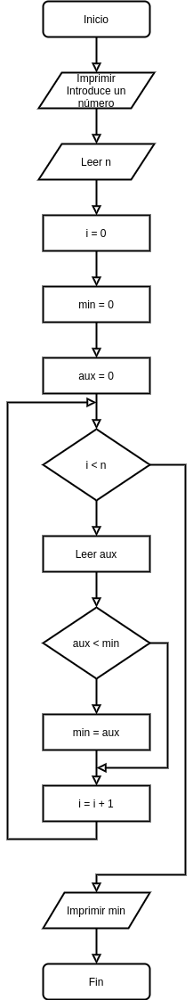

[`Introducción a la Programación`](../README.md) > [`Sesión 8`](../README.md) > `Ejemplo 2`

## Ejemplo 2: Valor mínimo

<div style="text-align: justify;">

### 1. Objetivos :dart:

- Poner en práctica el uso de la estructura de repetición `while`

### 2. Requisitos :clipboard:

1. Compilador de __C__ instalado

### 3. Desarrollo :rocket:

Se requiere un programa que pida un número indefinido de valores enteros al usuario (la primera entrada indica cuantos valores ingresarán) y que regrese como salida el menor de éstos.

#### Definición del problema
Es clara.

#### Análisis del problema
- Entrada: Sucesión de números leídos desde el teclado.
- Salida: Valor mínimo de la solución
- Proceso: 
   - Leer el primer valor para saber cuantos elementos se van a leer.
   - Establecer el 0 como mínimo
   - Si el siguiente elemento es menor al mínimo establecido, actualizar la variable. 
   - Continuar mientras no se hayan terminado de leer todos los números.
   - Mostrar resultado.

#### Diseño de la solución del problema


1. Inicio
1. Imprimir "Introduce un número: "
1. Leer n
1. i = 0
1. min = 0
1. aux = 0
1. Mientras i < n, ve al paso 8, si no, ve al paso 13
1. Leer aux
1. Si aux < min ve al paso 10 si no, ve al paso 11
1. min = aux
1. i = i + 1
1. Vuelve al paso 7 
1. Imprimir min
1. Fin.

#### Desarrollo de la solución del problema

```c
#include <stdio.h>

int main(void)
{
   // Declaración de variables
   int n;

   // Pedir datos al usuario
   printf("Introduce un número: ");
   scanf("%d", $n);

   int i = 0;
   int aux = 0;
   int min = 0;

   while (i < n)
   {
      scanf("%d", &aux);
      if (aux < min)
         min = aux;
      i++;
   }

   printf("\nResultado: %d\n", min);

   return 0;
}

```

[`Anterior`](../ejemplo01/README.md) | [`Siguiente`](../README.md#estructura-do-while)   

</div>
