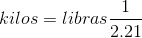

[`Introducción a la Programación`](../README.md) > [`Sesión 8`](../README.md) > `Ejemplo 3`

## Ejemplo 3: Menú de opciones

<div style="text-align: justify;">

### 1. Objetivos :dart:

- Poner en práctica el uso de la estructura de repetición `do-while`

### 2. Requisitos :clipboard:

1. Compilador de __C__ instalado

### 3. Desarrollo :rocket:

Modificaremos el Ejemplo de la sesión 7 que realizaba la conversión a pulgadas o kilogramos de manera que muestre un menú mientras el usuario no introduzca la opcion salir.

#### Definición del problema
Es clara.

#### Análisis del problema
- Entrada: Una opción del menú y de acuerdo a ésta, el valor en centímetros o en libras.
- Salida: Conversión a pulgadas o a kilogramos, según corresponda.
- Proceso:
   - Pedir opción del menú al usuario.
   - Pedir centímetros o libras de acuerdo a la opción elegida.
   - Realizar la conversión correspondiente.
   - Mostrar el resultado.
- Fórmulas:   
      
   

#### Diseño de la solución del problema


1. Inicio
2. Imprime "Introduce una opción"
3. Imprime "[1] Centímetros a pulgadas"
4. Imprime "[2] Libras a kilogramos"
5. Imprime "[3] Salir"
6. Imprime "Opción: "
7. Leer opcion
8. Según opcion, hacer:
   - Si opcion = 1:
      - Imprimir "Introduce la distancia en centímetros: "
      - Leer v
      - resultado = v / 254
      - Imprimr "Resultado: " + resultado
   - Si opcion = 2
      - Imprimir "Introduce el peso en libras: "
      - Leer v
      - resultado = v * (1 / 2.21)
      - Imprimr "Resultado: " + resultado
   - Si opción = 3
      - Ve al paso 9	
9. Mientras opción != 3, ve al paso 2. Si no, ve al paso 10.
10. Fin

#### Desarrollo de la solución del problema

```c
#include <stdio.h>

int main(void)
{
	// Declaración de variables.
	int opcion;
	float v;
	float resultado;

	do
	{
		// Mostrar el menú de opciones
		printf("Introduce una opción\n");
		printf("[1] Centímetros a pulgadas\n");
		printf("[2] Libras a Kilogramos\n");
		printf("[3] Salir\n");
		printf("Opción: ");
		scanf("%d", &opcion);

		// Procesar la opción elegida
		switch(opcion)
		{
			case 1:
			   printf("\nIntroduce la distancia en centímetros: ");
			   scanf("%f", &v);
			   resultado = v / 254;
			   printf("\nResultado: %f\n", resultado);
			   break;
			case 2:
			   printf("\nIntroduce el peso en libras: ");
			   scanf("%f", &v);
			   resultado = v * (1/2.21);
			   printf("\nResultado: %f\n", resultado);
			   break;
			case 3:
				break;
			default:
			   printf("\nEntrada incorrecto.\n");
		}

	} while (opcion != 3);

	// system("pause");
	return 0;
}
```

[`Anterior`](../README.md#estructura-do-while) | [`Siguiente`](../Ejemplo04/README.md)   

</div>
