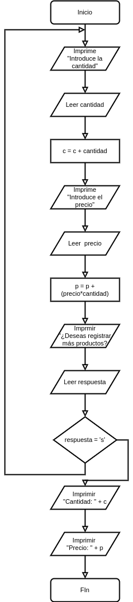

[`Introducción a la Programación`](../README.md) > [`Sesión 8`](../README.md) > `Ejemplo 4`

## Ejemplo 4: Generación de ticket

<div style="text-align: justify;">

### 1. Objetivos :dart:

- Poner en práctica el uso de la estructura de repetición `do-while`

### 2. Requisitos :clipboard:

1. Compilador de __C__ instalado

### 3. Desarrollo :rocket:

Definir un programa que dadas la cantidad y precio de distintos productos de una tienda, genere un ticket de compra. Se debe mostrar al final el total de la compra y número de productos comprados.

#### Definición del problema
Es clara.

#### Análisis del problema
- Entrada: Registros de compra (cantidad y precio)
- Salida: Total de productos comprados y total de compra.
- Proceso:
   - Pedir las cantidades y precios al usuario.
   - Mostrar los totales correspondientes.

#### Diseño de la solución del problema


1. Inicio
2. Imprime "Introduce la cantidad: "
3. Leer cantidad
4. c = c + cantidad
5. Imprime "Introduce el precio: "
6. Leer precio
7. p = p + (precio * cantidad)
8. Imprime "¿Deseas registrar más productos? (s/n)"
9. Leer respuesta
10. Mientras la respuesta sea 's', Ve al paso 2. Si no, ve al paso 6.
11. Imprime "Cantidad: " + c
12. Imprime "Total: " + t

#### Desarrollo de la solución del problema

```c
#include <stdio.h>

int main(void)
{
	// Declaración de variables.
	int cantidad;
	float precio;
	int c = 0;
	float p = 0.0;
	char respuesta;

	do
	{
		// Mostrar el menú de opciones
		printf("Introduce la cantidad: ");
		scanf("%d", &cantidad);
		printf("Introduce el precio: ");
		scanf("%f", &precio);

		c += cantidad;
		p += cantidad * precio;

		printf("\n¿Deseas registrar más productos? (s/n) ");
		scanf("%c", &respuesta);

	} while (respuesta == 's');

	printf("\nCantidad %d\n", c);
	printf("\nPrecio %f\n", p);

	// system("pause");
	return 0;
}
```

[`Anterior`](../Ejemplo03/README.md) | [`Siguiente`](../README.md#3-actividad-memo)   

</div>
