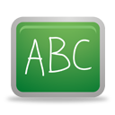

[`Introducción a la Programación`](../README.md) > `Sesión 9`

## Sesión 9: Estructura de repetición `for`


<div style="text-align: justify;">

### 1. Objetivos :dart:

- Repasar la sintaxis de las estructuras de control `while` y `do-while` del lenguaje de programación __C__.
- Escribir programas que hagan uso de las estructuras de control `while` y `do-while`.

### 2. Contenido :rocket:

---
#### <ins>Estructura de repetición `for`</ins>


Esta estructura es útil cuando se conoce el número de veces que se va a repetir un bloque de instrucciones. En su definición incluye explícitamente:

1. Inicialización
1. Condición
1. Bloque de instrucciones
1. Actualización

La sintaxis de un `for` es la siguiente:

```c
for (inicialización; condición; actualización)
{
	bloque-instrucciones
}
```

- [**`EJEMPLO 1`**](ejemplo01/README.md)
- [**`EJEMPLO 2`**](ejemplo02/README.md)

---

### 3. Actividad :memo:
Aplica lo todo lo que aprendiste durante la sesión en esta actividad. 

- [**`ACTIVIDAD 9`**](actividad/README.md)

[`Anterior`](../sesion08/README.md) | [`Siguiente`](../sesion10/README.md)

</div>
