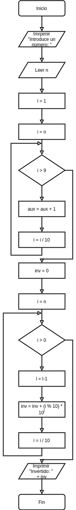

[`Introducción a la Programación`](../README.md) > [`Sesión 9`](../README.md) > `Ejemplo 2`

## Ejemplo 2: Invertir número

<div style="text-align: justify;">

### 1. Objetivos :dart:

- Poner en práctica el uso de la estructura de repetición `for`

### 2. Requisitos :clipboard:

1. Compilador de __C__ instalado

### 3. Desarrollo :rocket:

Se requiere un programa que pida un número al usuario e invierta sus dígitos. Por ejemplo 1729 se invierte como 9271. Si el número finaliza con ceros, deben omitirse en la inversión. Por ejemplo 1720 es 271.

#### Definición del problema
Es clara.

#### Análisis del problema
- Entrada: Número a invertir
- Salida: Número con los dígitos invertidos
- Proceso: 
   - Pedir número al usuario
   - Invertir sus dígitos
   - Mostrar resultados

#### Diseño de la solución del problema


1. Inicio
2. Imprimir "Introduce un número: "
3. Leer n
4. l = 1
5. i = n
6. Mientras i > 9 ir al paso 7, si no ir al paso 10
7. l = n + 1
8. i = i / 10
9. Ir al paso 6
10. inv = 0
11. i = n
12. Mientas i > 0 ir al paso 13, si no ir al paso 15
13. l = l - 1
14. inv = inv + (i % 10) * 10^(l)
15. Imprimir "Invertido: " + inv
16. Fin


#### Desarrollo de la solución del problema

```c
#include <stdio.h>
#include <math.h>

int main(void)
{
   int n;

   printf("Introduce un número: ");
   scanf("%d", &n);

   int l = 1;

   for (int i = n; i > 9; i /= 10)
      l++;

   int inv = 0;

   for (int i = n; i > 0; i /= 10)
      inv += (i % 10) * pow(10,--l);

   printf("\nInvertido: %d\n", inv);
   return 0;
}

```

[`Anterior`](../ejemplo01/README.md) | [`Siguiente`](../README.md#3-actividad-memo)   

</div>
