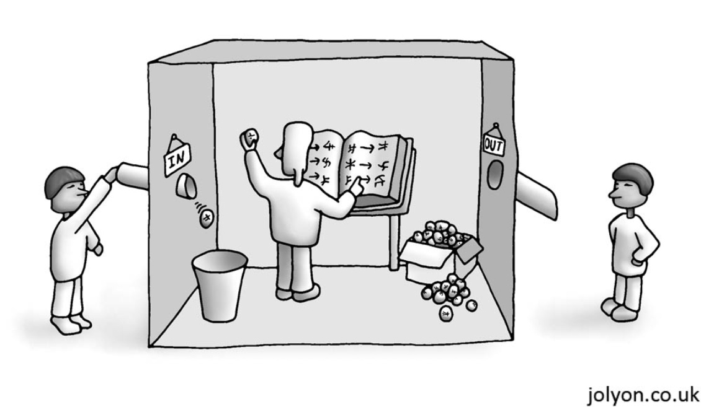
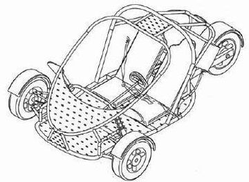

[`Introducción a la Programación`](../README.md) > `Sesión 10`

## Sesión 10: Definición de funciones


<div style="text-align: justify;">

### 1. Objetivos :dart:

- Repasar la sintaxis de la definición de funciones en el lenguaje de programación __C__.
- Escribir programas que hagan uso de funciones.

### 2. Contenido :rocket:

---
#### <ins>Funciones</ins>


Podemos pensar a las funciones como pequeños programas que dado un conjunto de datos de entrada, los procesan y producen
una salida. Los datos de entrada pueden ser de cualquier tipo de dato admitido por __C__, al igual que los datos de
salida.

La sintaxis para definir funciones es la siguiente:

```c
<tipo-regreso> <nombre>(<parámetros>)
{
	<instrucciones>
	return <valor>;
}
```

Cuando una función no recibe parámetros, se dejan los paréntesis vacíos o se coloca `void`. En caso contrario, se separa 
cada uno por comas indicando antes del tipo de dato de cada uno. Cuando una función no regresa nada, lo indicamos 
colocando `void` en el tipo de regreso y por lo tanto no se necesita la instrucción `return` queda sola o puede omitirse.

- [**`EJEMPLO 1`**](ejemplo01/README.md)
- [**`EJEMPLO 2`**](ejemplo02/README.md)
- [**`EJEMPLO 3`**](ejemplo03/README.md)

---
#### <ins> Prototipos</ins>


Los prototipos de funciones permiten al compilador de __C__ detectar errores de tipo antes de que el programa sea 
ejecutado.

Una buena práctica de programación consiste en colocar los prototipos correspondientes al inicio de cada programa. De
esta forma, el compilador nos ayuda a detectar posibles errores en tiempo de ejecución y al mismo tiempo permite colocar
las definiciones de funciones en cualquier punto del programa.

La sintaxis de un prototipo es:

```c
<tipo-regreso> <nombre>(<tipos>);
```

En este caso no importa el nombre de los parámetros, únicamente de qué tipo son.

- [**`EJEMPLO 4`**](ejemplo04/README.md)

---

### 3. Actividad :memo:
Aplica lo todo lo que aprendiste durante la sesión en esta actividad. 

- [**`ACTIVIDAD 10`**](actividad/README.md)

[`Anterior`](../sesion09/README.md) | `Siguiente`

</div>
