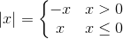

[`Introducción a la Programación`](../README.md) > [`Sesión 10`](../README.md) > `Actividad`

## Actividad 10

### 1. Objetivos :dart:

- Poner en práctica la definición de funciones.

### 2. Requisitos :clipboard:

1. Compilador de __C__ instalado

### 3. Desarrollo :rocket:

Completar el cuerpo de la función `absoluto` contenida en el archivo [`actividad10.c`](codigos/actividad10.c). La función debe calcular el valor absoluto de un número. Puedes usar la siguiente fórmula:

**Entrega:** 17 de abril de 2020

[`Anterior`](../README.md#3-actividad-memo) | [`Siguiente`](../README.md#3-actividad-memo)   

