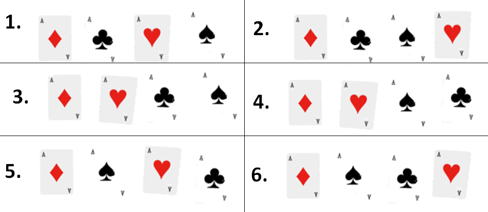

[`Introducción a la Programación`](../README.md) > `Sesión 11`

## Sesión 11: Funciones Recursivas en C


El uso de funciones recursivas simplifica bastate el código, haciéndolo más legible y fácil de analizar. Sin embargo,
si no se definen correctamente, podemos caer en ciclos infinitos fácilmente. Recordemos que para que una función 
recursiva sea válida, debe cumplir con:

- Contar con un conjunto de casos bases, para los cuales sepamos su resultado.
- Definir los casos recursivos de forma que se reduzcan los parámetros a un caso base.

Para poner en práctica esto, definiremos un programa que use funciones recursivas. Mantenemos el diseño que hemos 
llevado durante todo el curso.

### :dart: <ins>El problema</ins>

En las Notas de Clase, revisamos una definición de la función `factorial`:

```c
long factorial(int n)
{
   if (n == 0)
      return 1;
   return n * factorial(n-1);
}
```

Los números factoriales se utilizan sobre todo en combinatoria, para calcular combinaciones y permutaciones. A través de
la combinatoria, los factoriales también se suelen utilizar para calcular probabilidades.

---

> :warning: **Problema.**   
Dora Compiladora, ha sacado 4 ases de una baraja. Va a colocarlos sobre la mesa. ¿De cuántas maneras podría colocarlos?

---

Analizando el problema, notamos que lo que se está pidiendo es lo que se conoce como *permutación*, es decir, que 
averigüemos todas las maneras posibles en las que estas 4 cartas se pueden combinar teniendo en cuenta el orden en el 
que las colocamos.

Si comenzamos haciendo todas las maneras posibles moviendo primero el as de diamantes, podemos hacer 6 combinaciones:



También tendremos 6 combinaciones posibles con el as de tréboles, con el as de corazones y con el as de picas, es decir, 
6 combinaciones empezando con cada una de las 4 cartas: `4 * 6 = 24`. Por lo tanto la solución es que podemos colocar
las cartas de 24 maneras posibles.

Utilizando la función factorial, podríamos haber resuelto el problema de forma mucho más sencilla:

Pensamos en una sola combinación de los 4 ases:

- Cuando hemos elegido el primero, ya solo nos quedan 3 para elegir

- Cuando hemos elegido el segundo, ya solo nos quedan 2 para elegir

- Cuando hemos elegido el tercero, ya solo nos queda 1 para elegir

Por lo tanto, todas las combinaciones posibles serán 4 x 3 x 2 x 1.

O lo que es lo mismo, 4! = 24.

---

> :rocket: **Actividad.**   
Generaliza la función anterior, es decir, si en lugar de tener 4 cartas, tuviéramos *n* cartas. Da la solución a este
problema usando la metodología de solución de problemas. Ten en cuenta que debes usar la función `factorial`.

---

### :dart: <ins>La solución</ins>

Una posible solución a este problema, se presenta en el siguiente código.

[**`combinaciones.c`**](codigos/combinaciones.c)
```c
#include <stdio.h>

long factorial(int);

int main(void)
{
   int cartas;

   printf("Introduce el número de cartas: ");
   scanf("%d", cartas);

   printf("\nEl número de combinaciones es: %ld\n", factorial(cartas));

   return 0;
}

long factorial(int n)
{
   if (n == 0)
      return 1;
   return n * factorial(n-1);
}
```

`Anterior` | `Siguiente`
