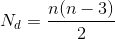

[`Introducción a la Programación`](../../README.md) > [`Sesión 10`](../README.md) > `Actividad`

## Actividad 11

<div style="text-align: justify;">

### 1. Objetivos :dart:

- Poner en práctica la definición de módulos.

### 2. Requisitos :clipboard:

1. Compilador de __C__ instalado

### 3. Desarrollo :rocket:

Completar el cuerpo de la función `numeroDiagonales` contenida en el archivo [`actividad11.c`](codigos/actividad11.c). La función debe calcular el número de diagonales de un polígono regular con *n* lados. Puedes usar la siguiente fórmula:



```c
/* Función que obtiene el número de diagonales de un polígono regular. */
int numeroDiagonales(int n)
{
	// Aquí va su código.
}
```

**Entrega:** 19 de abril de 2020

[`Anterior`](../README.md#3-actividad-memo) | [`Siguiente`](../README.md#3-actividad-memo)   

</div>
