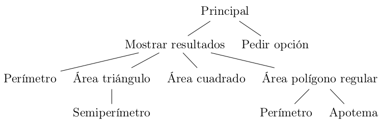

[`Introducción a la Programación`](../README.md) > [`Sesión 11`](../README.md) > `Ejemplo 1`

## Ejemplo 1: Área y promedio de polígonos regulares

<div style="text-align: justify;">

### 1. Objetivos :dart:

- Poner en práctica el concepto de programación modular mediante el uso de funciones en __C__.

### 2. Requisitos :clipboard:

1. Compilador de __C__ instalado

### 3. Desarrollo :rocket:

#### Detección de módulos

Vamos a desarrollar un programa que calcule el área y promedio de distintos polígonos regulares empleando programación modular. Para detercar los módulos en un programa, suele añadirse a la metodología de solución de problemas que hemos estudiado un análisis de detección de módulos, resultando un diagrama modular.

Por ejemplo, para el programa que queremos implementar se tiene el siguiente diagrama modular.



Cada uno de los nodos de este árbol representa un módulo a implementar mediante una función en __C__. Por lo tanto, añadimos la firma de cada función como prototipo, no es necesario colocar un prototipo para el módulo principal, pues éste es equivalente a  `main`.

```c
void mostrarResultados(int,float);
char pedirOpcion();
float perimetro(int,float);
float areaTriangulo(float);
float areaCuadrado(float);
float areaPoligonoR(int,float);
float semiPerimetro(float);
float apotema(int,float);
```

#### Módulo principal

Comenzamos definiendo la estructura general del módulo principal.

```c
// Módulo principal.
int main(void)
{
   // Número de lados de la figura.
   int n;
   // Medida de los lados de la figura.
   float m;
   // Opción para mantener el programa en ejecución.
   char o;

   do
   {
      printf("Introduce el número de lados: ");
      scanf("%d", &n);
      printf("Introduce la medida de los lados: ");
      scanf("%f", &m);

      mostrarResultados(n,m);

      o = pedirOpcion();
   } while (o != 'n');

   return 0;
}
```

Como podemos apreciar, el módulo principal es bastante corto y simple, el trabajo más pesado lo llevan el resto de los módulos. Veamos la definición de cada uno de éstos.

#### Mostrar resultados

```c
/* Función encargada de mostrar los resultados del programa a partir del número
   de lados del polígono y la medida de éstos. */
void mostrarResultados(int n, float m)
{
   switch(n)
   {
      case 3:
         printf("\nPerímetro: %f\n", perimetro(n,m));
         printf("\nÁrea: %f\n", areaTriangulo(m));
         break;
      case 4:
         printf("\nPerímetro: %f\n", perimetro(n,m));
         printf("\nÁrea: %f\n", areaCuadrado(m));
         break;
      case 5:
         printf("\nPerímetro: %f\n", perimetro(n,m));
         printf("\nÁrea: %f\n", areaPoligonoR(n,m));
         break;
      default:
         printf("\nDatos inválidos\n");
   }
}
```

#### Pedir opción

```c
/* Función encargada de preguntar al usuario si desea calcular el perímetro y
   área de otro polígono. */
char pedirOpcion() 
{
   char opcion;
   do
   {
      printf("\n¿Desea analizar otro polígono regular? (s/n): ");
      scanf(" %c", &opcion);
   } while (opcion != 's' && opcion != 'n');
   printf("\n");
   return opcion;
}
```

#### Perímetro

```c
/* Función que calcula el perímetro de un polígono regular. */
float perimetro(int n, float m) 
{
   return n * m;
}
```

#### Área Triángulo

```c
/* Función que calcula el área de un triángulo. */
float areaTriangulo(float m)
{
   float s = semiPerimetro(m);
   return sqrt(s*(s-m)*(s-m)*(s-m));
}
```

#### Área Cuadrado

```c
/* Función que calcula el área de un cuadrado. */
float areaCuadrado(float m)
{
   return pow(m,2);
}
```

#### Área polígono regular

```c
/* Función que calcula el área de un polígono regular en función de su 
   apotema. */
float areaPoligonoR(int n, float m)
{
   float a = apotema(n,m);
   float p = perimetro(n,m);

   return (p*a)/2;
}
```

#### Semiperímetro

```c
/* Función que calcula el semiperímetro de un triángulo. */
float semiPerimetro(float m)
{
   return (m*3)/2;
}
```

#### Apotema

```c
/* Función que calcula el apotema de un polígono regular. */
float apotema(int n, float m)
{
   float alpha = 360/n;
   return n / (2*tan(alpha/2));
}
```

#### Programa completo

[`figuras.c`](codigos/figuras.c)

```c
#include <stdio.h>
#include <math.h>

// Definición de prototipos.
void mostrarResultados(int,float);
char pedirOpcion();
float perimetro(int,float);
float areaTriangulo(float);
float areaCuadrado(float);
float areaPoligonoR(int,float);
float semiPerimetro(float);
float apotema(int,float);

// Módulo principal
int main(void)
{
   // Número de lados de la figura.
   int n;
   // Medida de los lados de la figura.
   float m;
   // Opción para mantener el programa en ejecución.
   char o;

   do
   {
      printf("Introduce el número de lados: ");
      scanf("%d", &n);
      printf("Introduce la medida de los lados: ");
      scanf("%f", &m);

      mostrarResultados(n,m);

      o = pedirOpcion();
   } while (o != 'n');

   return 0;
}

/* Función encargada de mostrar los resultados del programa a partir del número
   de lados del polígono y la medida de éstos. */
void mostrarResultados(int n, float m)
{
   switch(n)
   {
      case 3:
         printf("\nPerímetro: %f\n", perimetro(n,m));
         printf("\nÁrea: %f\n", areaTriangulo(m));
         break;
      case 4:
         printf("\nPerímetro: %f\n", perimetro(n,m));
         printf("\nÁrea: %f\n", areaCuadrado(m));
         break;
      case 5:
         printf("\nPerímetro: %f\n", perimetro(n,m));
         printf("\nÁrea: %f\n", areaPoligonoR(n,m));
         break;
      default:
         printf("\nDatos inválidos\n");
   }
}

/* Función encargada de preguntar al usuario si desea calcular el perímetro y
   área de otro polígono. */
char pedirOpcion() 
{
   char opcion;
   do
   {
      printf("\n¿Desea analizar otro polígono regular? (s/n): ");
      scanf(" %c", &opcion);
   } while (opcion != 's' && opcion != 'n');
   printf("\n");
   return opcion;
}

/* Función que calcula el perímetro de un polígono regular. */
float perimetro(int n, float m) 
{
   return n * m;
}

/* Función que calcula el área de un triángulo. */
float areaTriangulo(float m)
{
   float s = semiPerimetro(m);
   return sqrt(s*(s-m)*(s-m)*(s-m));
}

/* Función que calcula el área de un cuadrado. */
float areaCuadrado(float m)
{
   return pow(m,2);
}

/* Función que calcula el área de un polígono regular en función de su 
   apotema. */
float areaPoligonoR(int n, float m)
{
   float a = apotema(n,m);
   float p = perimetro(n,m);

   return (p*a)/2;
}

/* Función que calcula el semiperímetro de un triángulo. */
float semiPerimetro(float m)
{
   return (m*3)/2;
}

/* Función que calcula el apotema de un polígono regular. */
float apotema(int n, float m)
{
   float alpha = 360/n;
   return n / (2*tan(alpha/2));
}
```

[`Anterior`](../README.md#programación-modular) | [`Siguiente`](../README.md#3-actividad-memo)   

</div>
